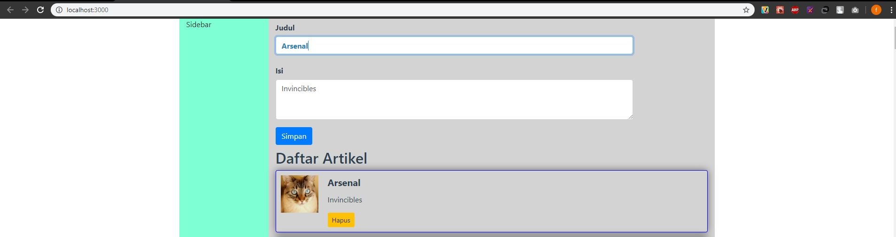
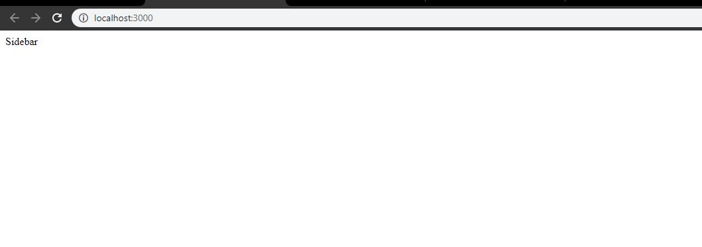

# Jawaban Pertanyaan Pertemuan 5

## Praktikum 1

1. a. Mengganti nama class menjadi container 

   Perbedaan container dengan container-fluid adalah, jika container memiliki margin left dan margin right sedangkan container-fluid akan mengisi keseluruhan width pada layar

   b. Dengan menginstal modulnya menggunakan 'npm' atau 'yarn'

## Praktikum 2

2. a. json server dijalankan pada port 3001 karena port 3000 sudah digunakan untuk aplikasinya. Sehingga satu port bisa dijlankan satu proses.

   b. data tidak akan tampil karena port 3000 sudah digunakan untuk aplikasi 

## Praktikum 3

3. a. Setelah di klik hapus, data akan terhapus dari list

   b. data yang tadinya dihapus juga ikut terhapus karena aplikasi menggunakan file json sebagai datanya

   c. Untuk mengambil data sesuai idnya lalu dilakukan method delete

   d. componentDidMount pada gambar 1.18 berisi statement untuk mengambil data dari jsonplaceholder, sedangkan pada gambar 3.2 statement tersebut dijadikan menjadi suatu fungsi bernama ambilDataDariServerAPI namun datanya diambil dari file listArtikel.json

## Praktikum 4

4. a. data terbaru yang diinputkan dari form berada pada posisi paling akhir

   b. karena setelah data di fetch, terdapat proses sorting secara descending, sehingga data yang tadinya berada dibawah pada listArtikel.json akan berpindah dipaling atas
